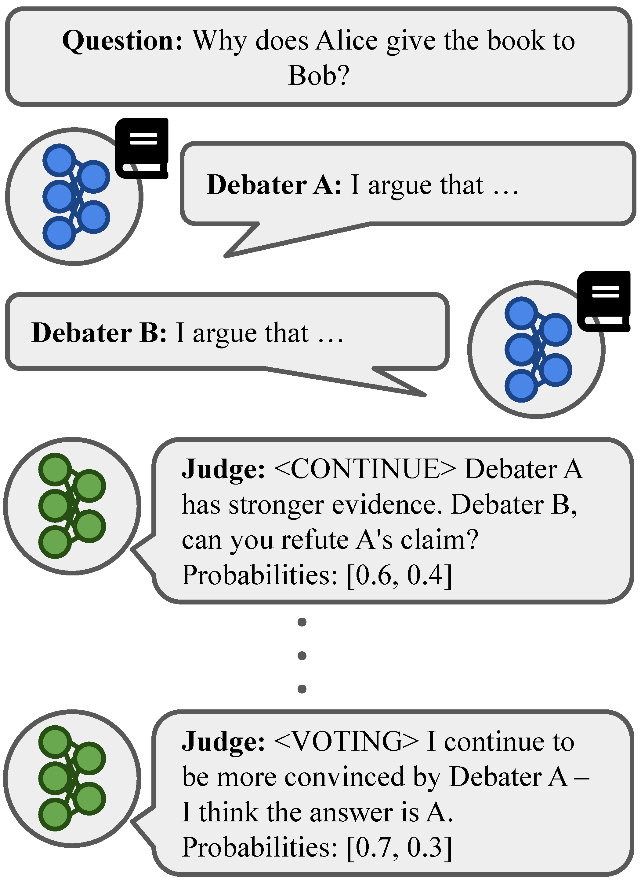

# Playing Large Games with Oracles and AI Debate


This is the repository for the debate experiments from "[Playing Large Games with Oracles and AI Debate](https://arxiv.org/abs/2312.04792)," by Xinyi Chen, Angelica Chen, Dean Foster, and Elad Hazan. We provide both the code and the [debate transcripts](debate_transcripts) from our experiments.

<p align="center">

</p>

This code is adapted from https://github.com/julianmichael/debate, with several major differences:
- We use a model judge, rather than a human.
- Unit tests
- Custom truncation (from passages in in-context examples)
- Addition of smooth optimization oracle options (as described in our paper)
- OpenAI chat utils library
- Config-based experiment set-up

## Set-Up
1. Clone this repo.
```
git clone git@github.com:angie-chen55/alignment-game-public.git
cd alignment-game-public
```

2. Install the Python dependencies necessary for this repo:
```
conda env create -f environment.yml -n alignment_game
conda activate alignment_game
```

3. Download the [QuALITY](https://github.com/nyu-mll/quality) data:
```
wget https://github.com/nyu-mll/quality/blob/main/data/v1.0.1/QuALITY.v1.0.1.zip
unzip QuALITY.v1.0.1.zip -d quality_dataset
```
(Update, Feb 2024: The QuALITY zip download seems to be a corrupted file that does not unzip on Linux systems. If you cannot unzip this file, try downloading the individual data files from https://github.com/nyu-mll/quality/tree/main/data/v1.0.1 into a directory named `quality_dataset` instead.)

4. Set up an OpenAI credentials file in this directory named `openai_creds.json` formatted like so:
```
{
    "api_key": "XXX",
    "organization_id": "YYY"
}
```
with "XXX" and "YYY" replaced with your OpenAI api key and organization ID, respectively.

## Experiments
Our experiments are config-based. To run each of the experimental set-ups described in our paper, run the following commands with `<OUTPUT_DIRECTORY>` replaced:
- <b>Control</b>: `python run_debate.py --output-dir=<OUTPUT_DIRECTORY> --config=control.yml`
- <b>Reward Noise</b>: `python run_debate.py --output-dir=<OUTPUT_DIRECTORY> --config=judge_prob_both.yml`
- <b>Debater Sampling</b>: `python run_debate.py --output-dir=<OUTPUT_DIRECTORY> --config=sampling_both.yml`
- <b>Combined</b>: `python run_debate.py --output-dir=<OUTPUT_DIRECTORY> --config=judge_prob_and_sampling.yml`

## Contact
If you have any further questions about the experiments in our paper, feel free to reach out at [ac5968] [@] [nyu.edu] (with the `[]`s removed).